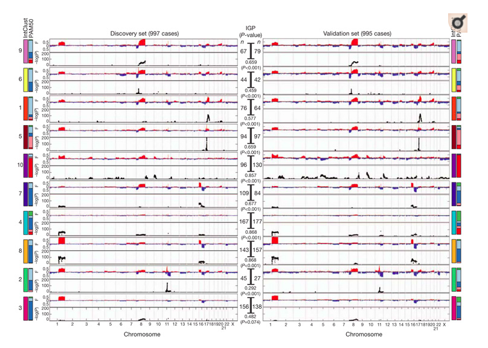
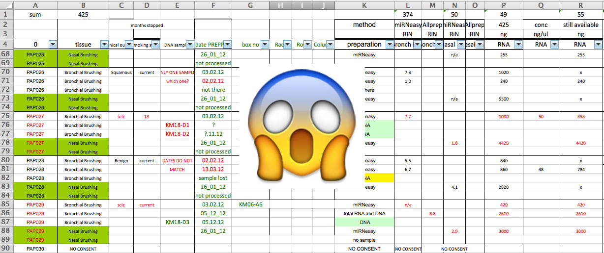
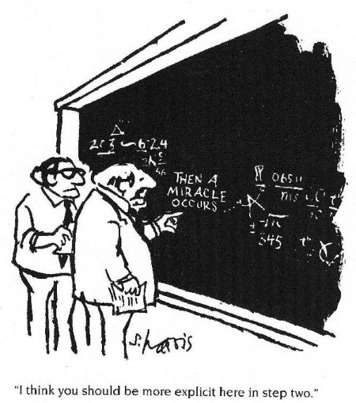
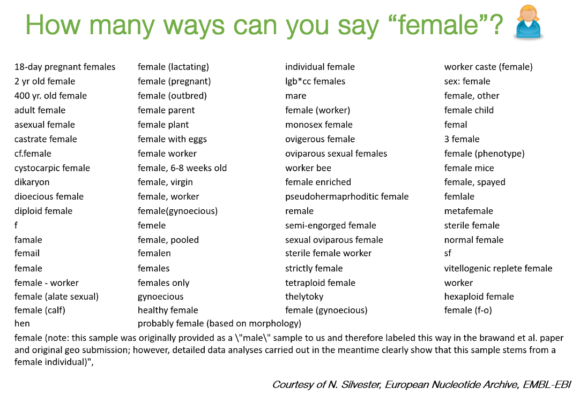
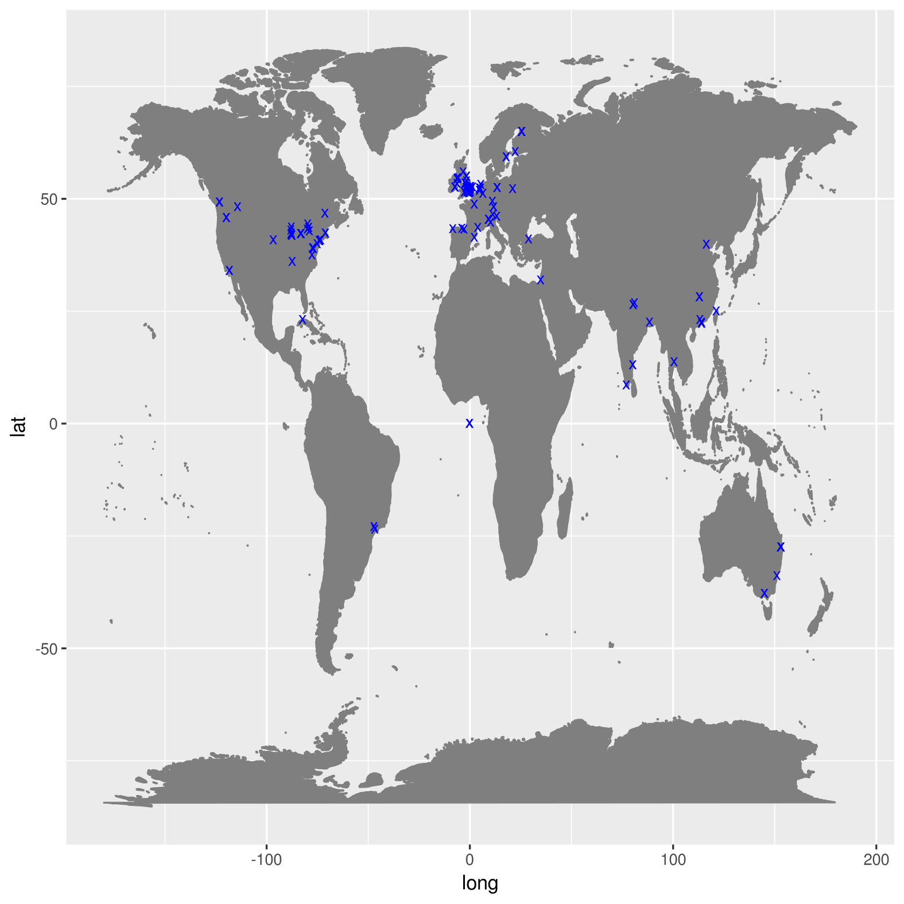

```{r setup, include=FALSE}
knitr::opts_chunk$set(echo = FALSE)
```
 
## Context


 
## Context 
 
- What the wet-lab scientists wanted us to spend time looking at



## Context

- What we *actually* spent time looking at (Disclaimer: not actual data from this project)



## Context

No matter how much of the analysis is automated, some manual steps are inevitably involved


## Why does it matter?




Cartoon by Sidney Harris (The New Yorker)


## Recommended Viewing 1

<iframe width="560" height="315" src="https://www.youtube.com/embed/Is15CMVPHas" frameborder="0" allow="autoplay; encrypted-media" allowfullscreen></iframe>

## Recommended Viewing 2

<iframe width="560" height="315" src="https://www.youtube.com/embed/e-7Pfi_bGaE" frameborder="0" allow="accelerometer; autoplay; encrypted-media; gyroscope; picture-in-picture" allowfullscreen></iframe>


## Reproducible Research

- At some point in the future, someone, somewhere, might want to repeat your analysis for themselves or re-use your data. 
    + which will most likely be ***you!***
- Assuming that you'll be able to remember all the steps involved is dangerous, so making sure that everything is well-documented is key. 


## Reproducible Research

- An analysis needs to be *automated* to be properly reproducible
- Tools like R, Python, will help with this but the data needs to be formatted correctly in the first place
    + R, Python cannot magically read any type of file you give them
- **Making spreadsheets tidy at the start of the analysis will save a lot of time in the long-run**


## Should we stop using Excel completely?

- ....Not neccesarily.
- Often much more convenient to eye-ball a spreadsheet and get an overall impression of your data. 
- But they have *limitations* making them not ideal for large-scale analyses. 
- Doing things by-hand only invites you to make copy-and-paste errors etc


## Rule 1


## Rule 1 - ***Never work directly on the raw data***


## Rule 1

- ***Never work directly on the raw data***
- Hard to reverse all the manual steps performed and invites errors
- Store the original data somewhere safe
    + see later
    


## Rule 2




## Rule 2 - ***Maintain consistency***


## Example 1

| Patient ID | Sex    | Date of Diagnosis     | Tumour Size
|------------|--------|-------------------|------------
| 1          | M      | 01-01-2013        |     3.1
| 2          | f      | 04-18-1998        |     1.5
| 3          | Male   | 1st of April 2004 |     105
| 4          | Female | NA                |     67
| 5          | F      | 2010/03/12        |     4.2
| 6          | F      |                   |     3.6
| 7          | M      | 1994-11-05T08:15:30-05:00         |     232


## Example 1

- Consistency: F, female, f, fem, 2, …
- Units
    + cm or mm; days, months or years
- You can introduce inconsistencies without realising it
    + blank spaces (whitespace) at the end of text
    + "Male " is not the same as "Male"
- Document choices you make about units in a *README* file


## Regarding dates

credit: @myusuf3


## Example 1 - corrected

| Patient ID | Sex  | Date of Diagnosis | Tumour Size
|------------|------|---------------|------------
| 001          | M    | 2013-01-01    |   3.1 
| 002          | F    | 1998-04-18    |   1.5
| 003          | M    | 2004-04-01    |   1.05
| 004          | F    | NA            |   0.67
| 005          | F    | 2010-03-12    |   4.2
| 006          | F    | NA            |   3.6
| 007          | M    | 1994-11-05   |   2.32


## Rule 3

Figure showing locations of visitors to my Prostate Cancer [data portal](http://bioinformatics.cruk.cam.ac.uk/apps/camcAPP/)




## Rule 3 - Don't use 0 to mean missing

- Zero values are data!
    + Sometimes extreme values such as 999 are sometimes used
- `NA` is Ok, but what if NA is a valid category in your data?
    + R will recognise `NA` as a missing value and can ignore it in calculations
- Safest to leave the cell *empty*
    + but you need to be careful with blank spaces


## Rule 4

| Patient ID | Date       | Value |
|------------|------------|-------|
| 1          | 2015-06-14 | 213   |
| 2          |            | 76.5  |
| 3          | 2015-06-18 | 32    |
| 4          |            | 120.3 |
| 5          |            | 109   |
| 6          | 2015-06-20 |       |
| 7          |            | 143   |


## Rule 4 

 Fill in all the cells


## Rule 4

- It is tempting to make the table look cleaner by not repeating some values
- Fill in all cells!
    + otherwise, problems when sorting
- Empty cell:
    + missing value?
    + value meant to be repeated multiple times?
- Make sure it’s clear that the data is missing and not unintentionally left blank


## Example 2 Corrected

| Patient ID | Date       | Value |
|------------|------------|-------|
| 1          | 2015-06-14 | 213   |
| 2          | 2015-06-14 | 76.5  |
| 3          | 2015-06-18 | 32    |
| 4          | 2015-06-18 | 120.3 |
| 5          | 2015-06-18 | 109   |
| 6          | 2015-06-20 | NA    |
| 7          | 2015-06-20 | 143   |


## Rule 5


## Rule 5

Make it rectangle

- The computer expects a very rigid shape of data with rows and columns
- Each column is a *variable* being examined
- Each row is an observation
- A concept commonly known as [*tidy data*](http://vita.had.co.nz/papers/tidy-data.pdf)


## Rule 5


## More

- Don’t put too much information in one cell
    + 1 cell = 1 piece of information
- Don’t include units such as "30 g" → "g" in the column name
    + http://unitsofmeasure.org/ucum.html 
- Write notes in a separate column or data dictionary or metadata 
    + "0 (below threshold)"
    


## More

- NO calculations
- NO font colours
- NO highlighting

Computer doesn’t recognize it!


## Write Protection

Mac 

- Right click on the file in Finder
- Select “Get Info”
- Sharing and permission
- Priviledge
- Read only


## Write Protection

Windows

- Right click on the file in windows explorer
- Properties
- General tab
- Attributes
- Select the box for “read only” 


## Heplful Data Validation feature in Excel

- Excel data validation feature
- Select a column
    + In the menu bar, choose “Data”
    + Validation
- Integer or decimal number
- Range
- List of possible values
- Limited length text


## Less helpful features in Excel

- When identifiers are long integers
    + 1000000 = 1e06
    + [Issue with Illumina microaray chip IDs](https://support.illumina.com/bulletins/2016/10/important-information-about-using-digit-beadchip-barcodes-in-genomestudio-sample-sheets.html)
- [Excel can convert gene names to dates](https://genomebiology.biomedcentral.com/articles/10.1186/s13059-016-1044-7)
    + SEPT2 (Septin 2) → ‘2-Sep’
    + MARCH1 (Membrane-Associated Ring Finger (C3HC4) 1, E3 Ubiquitin Protein Ligase) → ‘1-Mar’


## Practice

- Download the file `patient-data.xlsx` and open in Excel, or equivalent software
    + this is a simulated, but representative, example of ***bad data***
    + discuss with your neighbours what aspects of the dataset would make it difficult for a computer to process (around 5 minutes)
- The next step is to look at how to clean the data with *Open Refine*


