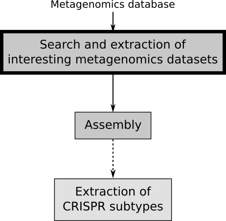
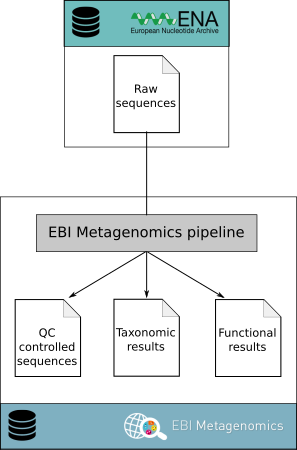
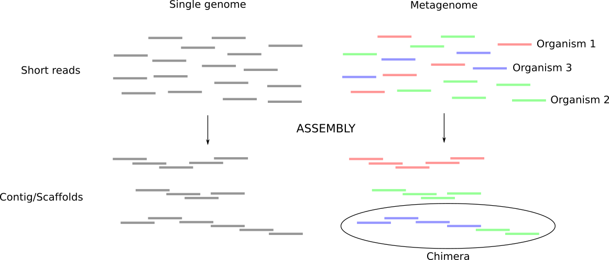
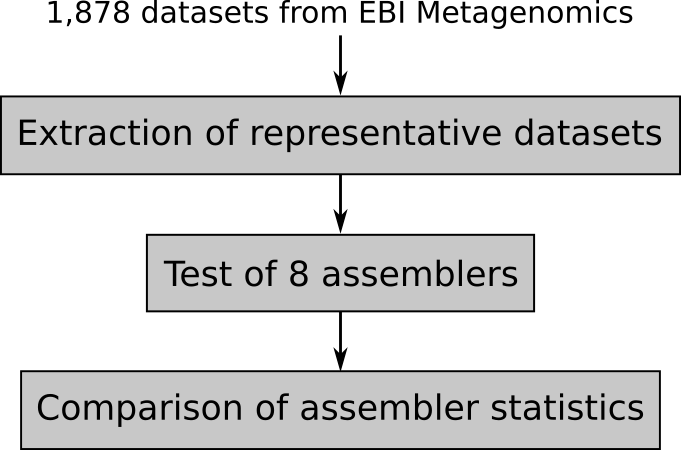
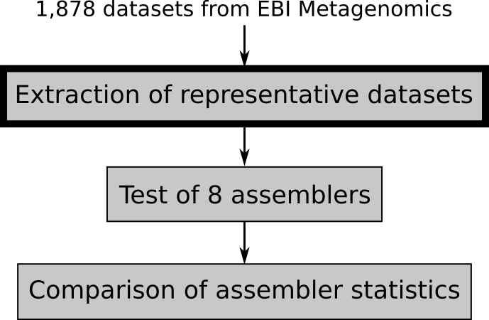
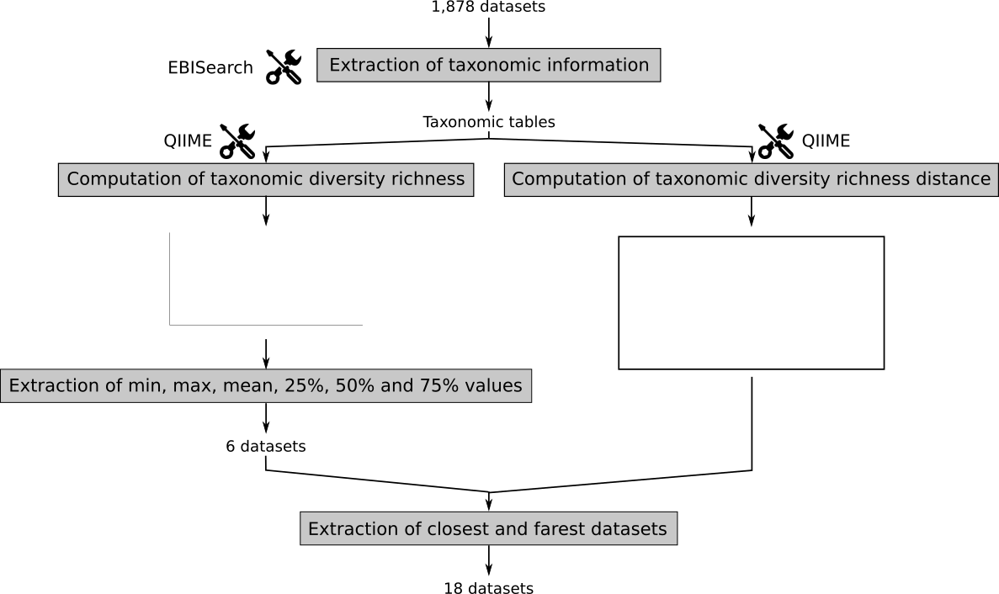
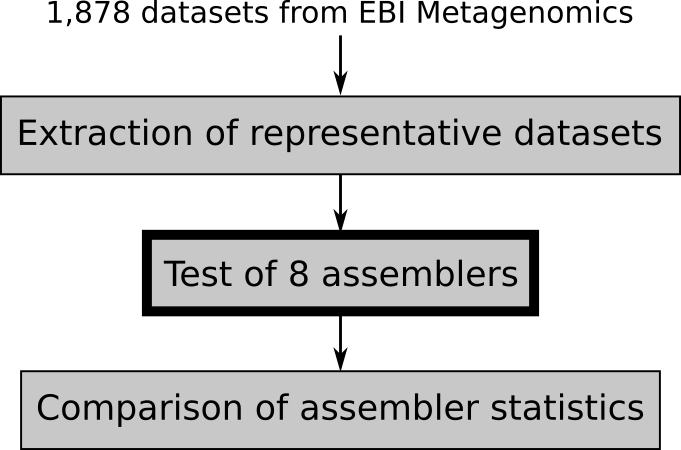
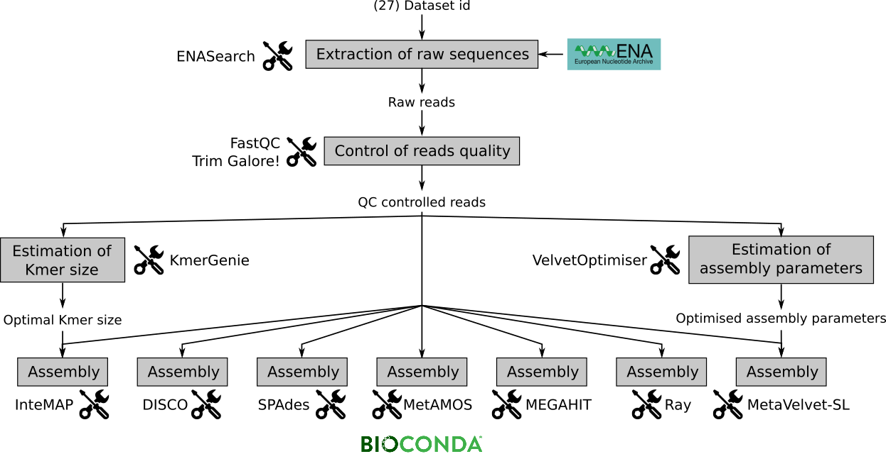
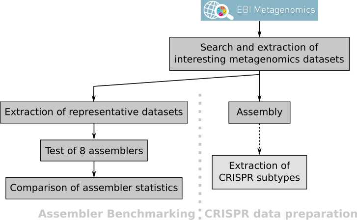

Hello! I am [Bérénice](http://bebatut.fr/), the author of following slides.

<small>
This slide does not exist in original deck. It is useful if you are not familiar with [Reveal.JS](https://github.com/hakimel/reveal.js), used here.
</small>

The easiest way to navigate this slide deck is by hitting `[space]`on your keyboard.

---

### Playing with metagenomics data, databases and assemblers

 <!-- .element height="50%" width="50%" -->

Bérénice Batut

<small>
Backofen lab retreat  April 2017
</small>

---

### Starting point

**Finding good metagenomics datasets  to extract new CRISPR-subtypes**

Good metagenomics datasets?
    <ul>
        <li class="fragment" data-fragment-index="1">Long sequences</li>
        <li class="fragment" data-fragment-index="1">Enough sequences</li>
        <li class="fragment" data-fragment-index="1">Different organisms</li>
    </ul>

---

### Analysis idea

---

----

### Metagenomics databases

- DDBJ
- NCBI
- EBI Metagenomics
- MG-Rast

----

### EBI Metagenomics

----

### Extraction from EBI Metagenomics

---

----

### Why is metagenome assembly so hard?

----

### Metagenomics assemblers

Name | Version | First release | Last update
--- | --- | --- | ---
[Ray Meta](http://denovoassembler.sourceforge.net/) | 2.3.1 | 2010 | 2014
[IDBA-UD](http://i.cs.hku.hk/~alse/hkubrg/projects/idba_ud/index.html) | 1.1.3 | 2011 | 2016
[SOAPdenovo](http://soap.genomics.org.cn/soapdenovo.html#down2) | 240 | 2011 | ? - Replaced by MegaHIT
[MegaHIT](https://github.com/voutcn/megahit) | 1.1.1 | 2014 | 2016
[MetaVelvet](http://metavelvet.dna.bio.keio.ac.jp/MV.html) | 1.2.10 | 2011 | 2012 - Replaced by MetaVelvet-SL
[MetaVelvet-SL](http://metavelvet.dna.bio.keio.ac.jp/MSL.html)| 1.0 | 2014 | 2014
[SPAdes](http://cab.spbu.ru/software/spades/) | 3.10.1 | 2011 | 2017
[Omega](http://omega.omicsbio.org/) | | 2014 | ? - Replaced by DISCO
[DISCO](http://disco.omicsbio.org/) | 1.0 | 2016 | 2017
[InteMAP](http://cqb.pku.edu.cn/ZhuLab/InteMAP/index.html) | 1.0 | 2015 | 2015
[MetAMOS](http://metamos.readthedocs.io/en/) | 1.5rc3 | 2011 | 2016

----

### Benchmarking of metagenomics assemblers

- 3 recent studies
    - [Comparing and Evaluating Metagenome Assembly Tools from a Microbiologist’s Perspective - Not Only Size Matters!](http://journals.plos.org/plosone/article?id=10.1371/journal.pone.0169662)
    - [Critical Assessment of Metagenome Interpretation − a benchmark of computational metagenomics software](http://biorxiv.org/content/early/2017/01/09/099127)
    - [Assembling Metagenomes, One Community At A Time](http://biorxiv.org/content/early/2017/03/24/120154)
- 2 recent assemblers never benchmarked
    - DISCO
    - InteMAP

----

### Idea for benchmarking

----

----

### Extraction of representative datasets

----

----

### Test of assemblers

----

----

### Ideas to compare the assemblers

- [MetaQUAST](http://quast.sourceforge.net/metaquast) statistics
    - Number of contigs above various lengths
    - Assembly span above various lengths
    - N50 lengths
    - L50 lengths
- Computation statistics
    - Computation time
    - Used RAM
- Taxonomic diversity estimation

---

### Playing with metagenomics: Sum up

----

### Still to do

- Run all assemblers on the representative datasets
- Compare the assembler statistics
- Select the more generalist assembler
- Run the selected assemblers on every possible dataset
- (Extract the CRISPR subtypes)

---

### Thank You!

